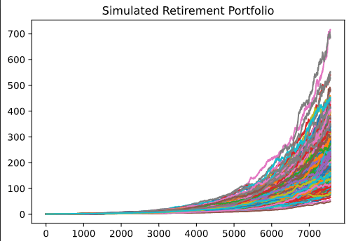
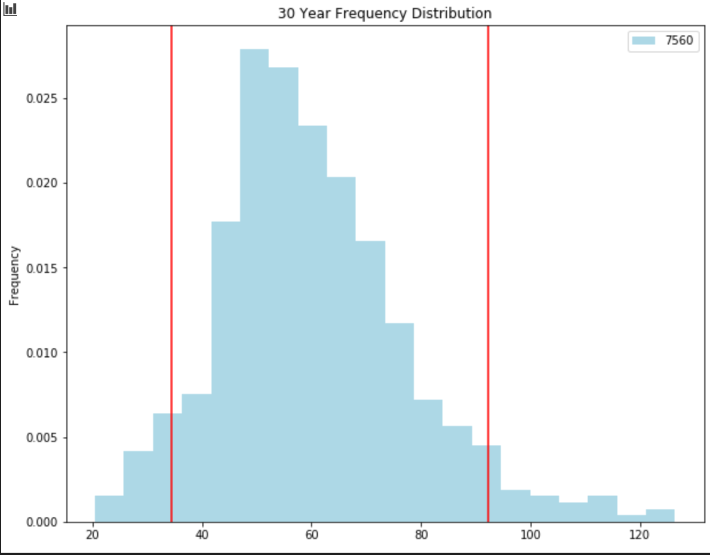
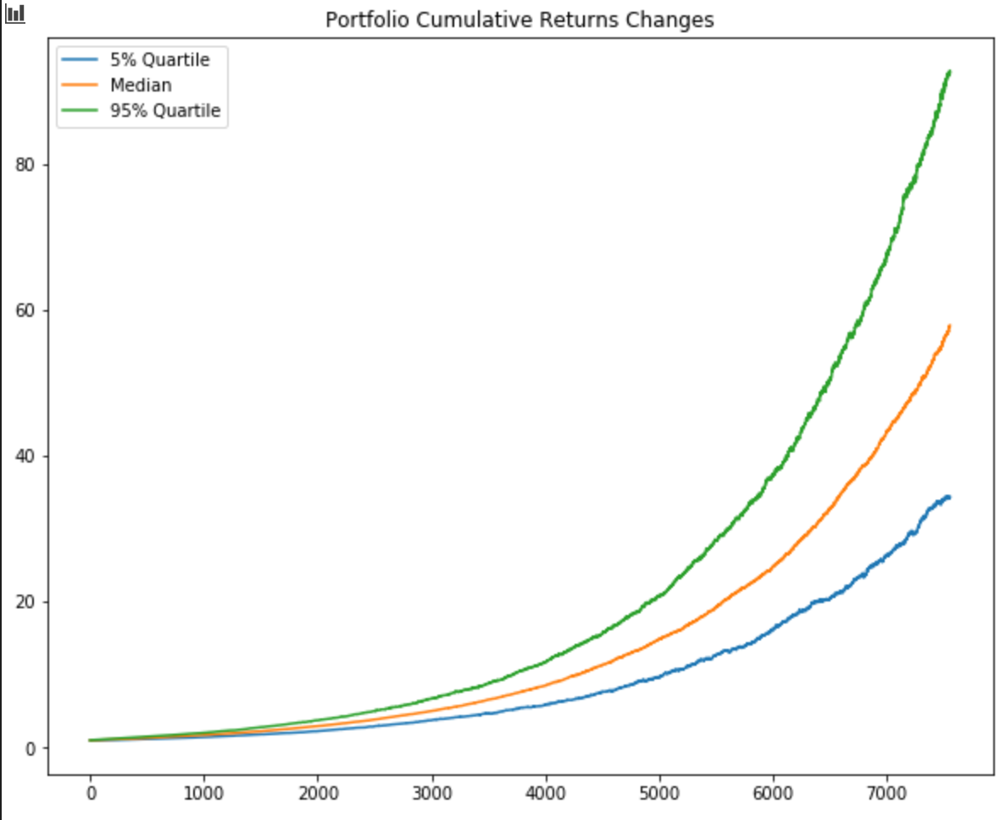
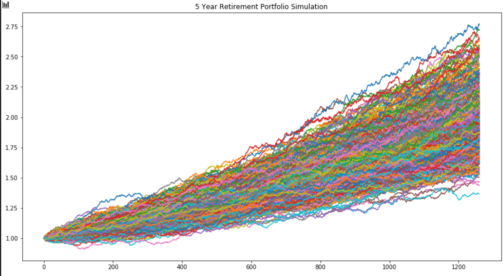
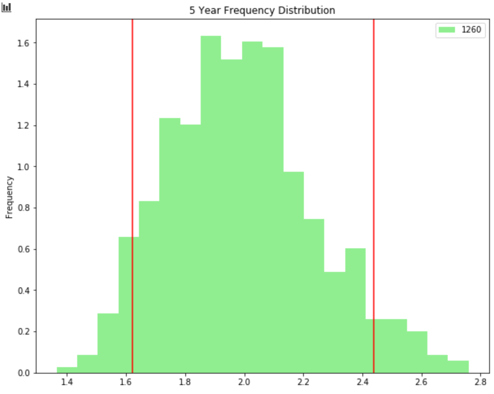

# Financial Report

This financial report provides the Consumer App Team income analysis and retirement portfolio projections.
The use of the PLAID API developer sandbox and ALPACA historical trade data provides the team with the selected retirement portfolio's projected thirty year performance based on the budget and investment simulations presented in the Account Summary and Portfolio Planner files.

---
## Report Outline

- [Account Summary](#Account-Summary)
    - [Budget Analysis](#Budget-Analysis)
    - [Income Summary](#Income-Summary)

- [Retirement Portfolio](#Retirement-Portfolio)
    - [Monte Carlo Simulation](#Monte-Carlo-Simulation)
    - [Performance Analysis](#Performance-Analysis)
    - [Challenge 1: Retirement Analysis](#Retirement-Analysis)
    - [Challenge 2: Early Retirement](#Early-Retirement)

- [Conclusion](#Conclusion)

---

## Account Summary

This section uses the PLAID API key to retrieve transaction and account data for a 90 day period to compile a budget analysis and income summary. 

### Budget Analysis

Through the use of a transactions dataframe, consumer spending was calculated to produce a tabular and graphical representation of expenses per spending category. Observed in the "Expenses Pie Graph", a significant percentage of consumer spending originates from the "Transfer" expense category. Additionally, based on the retireved data, it is evident that the three month spending habits are fairly consistent ranging from $10 560.06 to $10 645.24. The final displayed month (7), is believed to be incomplete data for the selected ninety-day period. The spending data for this month was $101.51, therefore, does not produce a complete bar in the "Spending per Month Bar Chart."

* The budget analysis is displayed through an "Expenses Chart", "Expenses Pie Graph", and a "Spending per Month Bar Chart."

#### Expenses Chart
| Category      | Amount |
| ----------- | ----------- |
| Food and Drink | 3317.19
Payment      |   6310.50
Recreation   |     235.50
Shops        |    1500.00
Transfer    |    20537.34
Travel       |     35.19 

#### Expenses Pie Graph

#### Spending per Month Bar Chart

### Income Summary

The income data fetched through the PLAID sandbox is; 

- Previous year gross income: $7285

- Current monthly income: $500

- Projected yearly income pre tax: $7389

- Projected yearly income post tax: $6085

---

## Retirement Portfolio

In the Retirement Portfolio section, the use of an ALPACA API retrieves the historical closing prices for the retirement portfolio; SPY (SPDR S&P 500 ETF) and AGG (iShares Core U.S. Aggregate Bond ETF). Through the use of Monte Carlo simulations, the portfolio's performance is projected over a 30 year time period. The analysis suggests investment in the selected portfolio will yield a potential profit at the end of the period.

The retirement portfolio consists of a 60% stock, "SPY", and 40% bond, "AGG" allocation. 

* Portfolio Volatility: 
    * SPY: 0.00782
    * AGG: 0.00208

* Portfolio Average Daily Returns: 
    * SPY: 0.00104
    * AGG: 0.00021 

### Monte Carlo Simulation

The Monte Carlo simulation consists of 500 iterations over a 30 year timeframe. 

At a 90% confidence interval, the investment dollar yield ranges from $34.50 to $92.24. Most likely providing a return at $63.37.

### Performance Analysis

#### Cumulative Returns at the End of 30 Years

| Percentile      | Cumulative Return |
| ----------- | ----------- |
| 10th Percentile |  41.261998
50th Percentile   |    57.734117
90th Percentile   |    82.333470

#### Portfolio Returns Given a $20 000 Initial Investment

| Percentile      | Cumulative Return |
| ----------- | ----------- |
| 10th Percentile |  $845240.0
50th Percentile   |    $1174682.0
90th Percentile   |    $1666669.0

#### Portfolio Returns Given a $30 000 Initial Investment

| Percentile      | Cumulative Return |
| ----------- | ----------- |
| 10th Percentile |  $1267860.0
50th Percentile   |    $1762024.0
90th Percentile   |    $2500004.0

The historical data for the retirement portfolio consisting of 60% "SPY" stocks and 40% "AGG" bonds returned high equities for retrieved 2019 period. Thus, a 4% retirement withdrawl at either a $20 000 or $30 000 principal investment does not exceed the current post tax annual income of $6085.

### Retirement Analysis

The "Portfolio Cumulative Returns Changes" line chart displays the changes in expected cumulative returns at a 90% confidence interval for the fifth, fiftieth, and ninety-fifth quartiles. 

### Early Retirement

Adjusting the retirement period from 30 years to 5 years, increasing the stock to bond distribution in the given portfolio is required to maintain a 4% withdrawl. In the new scenario, the portfolio allocation consists of 80% stocks, "SPY", and 20% bonds, "AGG."

At a 90% confidence interval, the potential dollar investment yield can range from $1.62 to $2.44.

---

## Conclusion 

- A principal investment of $20 000 at the tenth percentile based on a 4% withdrawl, $33 809.0,  will exceed the current projected annual income of $6805. 

- A 50% increase in the initial investment at the tenth percentile based on a 4% withdrawl, $1 267 849.0, will also exceed the current projected annual income. 

- To retire in 5 years, the initial investment must be significantly higher to return a more profitable dollar investment yield regardless of a higher stock to bond allocation ratio. 

- In conclusion, investing in the retirement portfolio;  SPY (SPDR S&P 500 ETF) and AGG (iShares Core U.S. Aggregate Bond ETF), at a 30 year return period is a profitable investment based on the presented data and analysis. 

