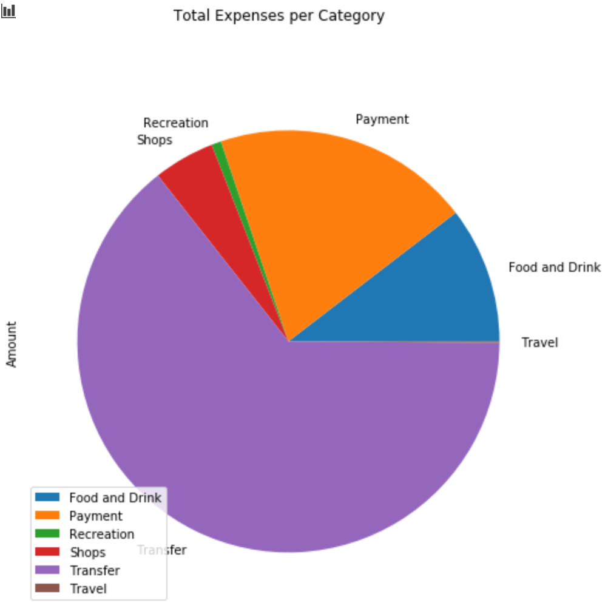
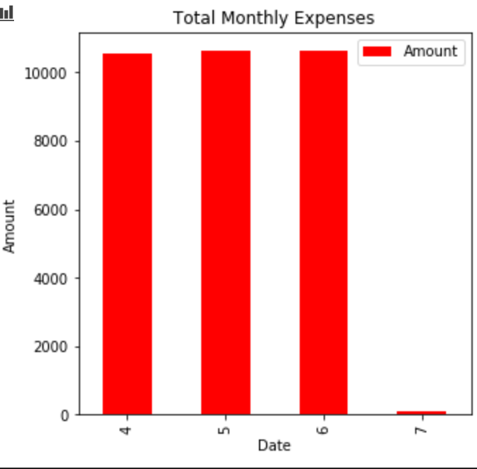

# Financial Report

This financial report provides the Consumer App Team income analysis and retirement portfolio projections. 
The use of the PLAID API developer sandbox and ALPACA historical trade data provides the team with the selected retirement portfolio's thirty year performance based on the budget and investment simulations presented in the Account Summary and Portfolio Planner files.

---
## Report Outline

- [Account Summary](#Account-Summary)
    - [Budget Analysis](#Budget-Analysis)
    - [Income Summary](#Income-Summary)

- [Retirement Portfolio](#Retirement-Portfolio)
    - [Monte Carlo Simulation]
    - [Performance Analysis]
    - [Challenge 1: Retirement Analysis]
    - [Challenge 2: Early Retirement]

---

## Account Summary

This section uses the PLAID API key to retireve transaction and account data for a 90 day period to complile a budget analysis and income summary. 

### Budget Analysis

Through the use of a transactions dataframe, consumer spending was calculated to produce a tabular and graphical representation of expenses per spending category. Observed in the "Expenses Pie Graph", a significant percentage of consumer spending originates from the "Transfer" expense category. Additionally, based on the retireved data, it is evident that the three month spending habits are fairly consistent ranging from $10 560.06 to $10 645.24. The final displayed month (7) is believed to be incomplete data. The spending data for this month was $101.51, therefore, does not produce a complete bar in the "Spending per Month Bar Chart."

* The budget analysis is displayed through an "Expenses Chart", "Expenses Pie Graph", and a "Spending per Month Bar Chart."

#### Expenses Chart
| Category      | Amount |
| ----------- | ----------- |
| Food and Drink | 3317.19
Payment      |   6310.50
Recreation   |     235.50
Shops        |    1500.00
Transfer    |    20537.34
Travel       |     35.19 

#### Expenses Pie Graph

#### Spending per Month Bar Chart

### Income Summary

The income data fetched through the PLAID sandbox is; 

- Previous year gross income: $7285

- Current monthly income: $500

- Projected yearly income pre tax: $7389

- Projected yearly income post tax: $6085

---

## Retirement Portfolio